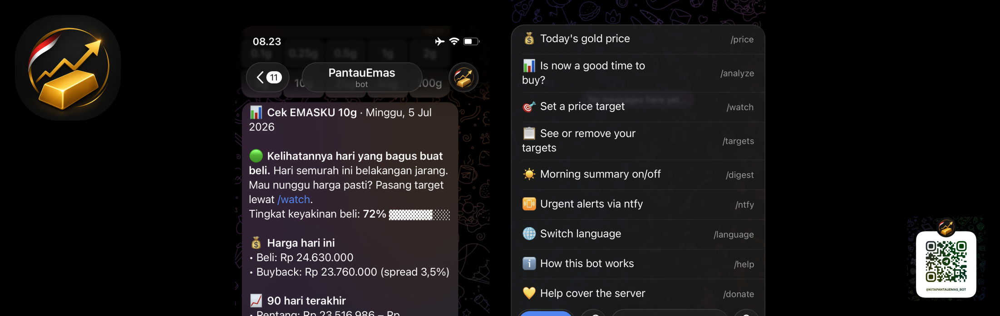

# PantauEmas

A free Telegram bot that watches Indonesian physical gold prices for you and
your friends. Everyone sets their own buy targets in their own language
(English or Bahasa Indonesia), and the bot pings each person the moment the
price drops into their zone. No trading, no prediction, just "it's cheap, go
get it."

## Project overview

Gold shops publish a new price every day. Unless you check manually, you find
out you missed your buy price after it's already back up. This bot does the
checking.

What it does:

- **Buy targets per user**: set your levels through a chat wizard (/watch,
  pick a brand and size, type a price). A target fires once with an urgent
  push, then re-arms after the price recovers, so it never spams.
- **Two brands**: EMASKU (every bar size, via HRTA Gold's API) and LM Antam
  (per gram, current production, via Aneka Logam). Watch either or both.
- **Dip detection**: a 2%+ drop below the 14-day high gets flagged to everyone
  watching that brand and size, even when it lands between their targets.
  Targets are guesses; this catches what they miss.
- **Morning digest**: a daily summary with a cheapness read: what share of the
  last 90 days were more expensive than today, the trend, the buy/buyback
  spread, whether world gold or the rupiah moved the price, and a one-word
  verdict (CHEAP / NEUTRAL / EXPENSIVE).
- **Full price board**: /price shows your sizes, one tap expands to every size
  of every brand, each labeled with the source it came from.
- **Buy-timing check**: /analyze answers "is now a good time?" with pure
  statistics: the 90-day range, percentile, trend, and a transparent
  4-signal checklist that scores today into a green / yellow / red verdict.
  No AI, no prediction, every signal shown.
- **ntfy channel**: optional second alert path via the free ntfy app. Target
  hits arrive as urgent pushes that cut through silent mode. Each user gets
  their own private topic with a one-tap copy button.
- **Price history**: both brands get logged daily, and a one-time `backfill`
  command rebuilds about a year of history per brand and size, so the
  analysis is useful from day one instead of after three months.

One price check serves every user: the sources return all sizes in a single
call each, so 1 user or 500 costs the same few requests a day. Everything
runs on free tiers.

More detail in [`docs/`](docs/):
[architecture](docs/architecture.md) ·
[telegram bot](docs/telegram-bot.md) ·
[how it works](docs/how-it-works.md) ·
[data sources](docs/data-sources.md) ·
[configuration](docs/configuration.md) ·
[deployment](docs/deployment.md) ·
[troubleshooting](docs/troubleshooting.md)

## Tech stack

| Layer | Choice |
|---|---|
| Runtime | Node.js 22.5+, TypeScript (run via `tsx`, no build step) |
| Dependencies | Zero at runtime. Native `fetch` for HTTP, `node:sqlite` for storage |
| Bot | Raw Telegram Bot API client, long polling, inline keyboards, no SDK |
| i18n | English + Bahasa Indonesia, per-user, switchable with /language |
| Extra pushes | Per-user [ntfy](https://ntfy.sh) topics via /ntfy |
| Storage | SQLite at `data/pantauemas.db` (users, watches, prices, backfill) |
| Scheduler | Built-in WIB clock loop inside the bot process |
| Market data | HRTA Gold API, EmasKITA HTML (fallback), Aneka Logam (Antam), Yahoo Finance (gold + USD/IDR) |
| Container | Docker + docker compose, `node:22-alpine` |
| Tests | Node's built-in test runner (31 tests, in-memory SQLite) |

## Setup and run

Needs Node 22.5+ (or just Docker).

1. Create a bot with [@BotFather](https://t.me/BotFather) and copy the token.
2. Then:

```sh
npm install
cp .env.example .env    # paste TELEGRAM_BOT_TOKEN
npm run backfill        # once: seeds ~1y of price history per brand and size
npm run bot             # long-running: bot + scheduled checks
```

Open your bot in Telegram, hit /start, pick a language, and set a target with
/watch. That's the whole onboarding, for you and anyone you share the bot with.

Other commands:

```sh
npm run tick     # one price check right now (fires due alerts)
npm run digest   # send the morning summary right now
npm test         # unit tests
```

Without `TELEGRAM_BOT_TOKEN` set, messages print to stdout instead of sending.
Handy for poking at it locally.

## Deploy

On a VPS with Docker:

```sh
git clone <your-repo-url> && cd pantauemas
cp .env.example .env       # paste the bot token
npm install && npm run backfill
docker compose up -d --build
docker logs -f pantauemas
```

All state lives in `./data/pantauemas.db`, mounted into the container, so
restarts and rebuilds lose nothing. One rule: never run two instances with the
same bot token, they'll fight over updates. Full guide in
[docs/deployment.md](docs/deployment.md).

---

Made with ❤️ and 🎵 by **rbayuokt**
