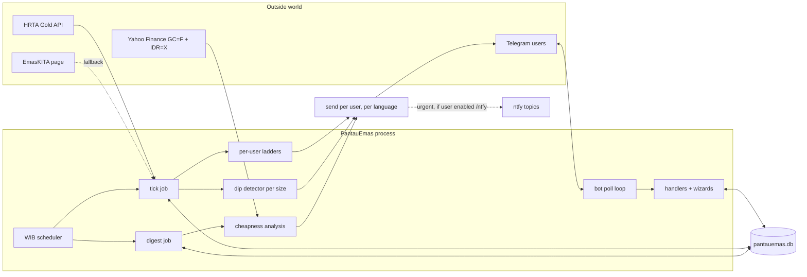

# Architecture

PantauEmas is a single small process: one Telegram bot with a price-checking
scheduler inside it. The design goal was "runs unattended for months on a VPS
and serves many users without me thinking about it", which mostly meant: no
framework, no runtime npm dependencies, SQLite for state, and every external
call wrapped so one flaky source or one blocked user never kills a run.

## Big picture



Two loops run concurrently in the same process:

- **Poll loop**: long-polls Telegram's getUpdates and feeds every message or
  button tap to the handlers. This is the interactive side (wizards, lists,
  toggles).
- **Schedule loop**: sleeps until the next tick/digest time in WIB, runs the
  job, repeats. This is the proactive side (alerts, digests).

They share the SQLite handle; Node's single thread means no locking to think
about.

## Module layout

```
src/
  index.ts        entry point: bot | tick | digest | backfill
  config.ts       .env loader (hand-rolled) into a typed Config
  util.ts         WIB time math, rupiah/percent formatting, price input parsing
  types.ts        shared interfaces

  bot/
    api.ts        raw Telegram Bot API client: long polling, sends, keyboards
    i18n.ts       every user-facing string, en + id, one table
    copy.ts       builds alert/digest/list messages from data + i18n
    handlers.ts   command routing, /watch wizard, callback buttons

  core/
    db.ts         schema + open (WAL mode); in-memory variant for tests
    store.ts      all SQL: users, watches, prices, backfill, dip state
    targets.ts    pure rung fire/re-arm logic
    dip.ts        pure drop-from-recent-high detector
    analysis.ts   percentile, trend, spread, price-driver attribution

  jobs/
    tick.ts       fetch prices, evaluate every user's ladder, dips, send
    digest.ts     per-user morning summary
    backfill.ts   ~1y synthetic history per bar size

  sources/
    market.ts     all brands in one fetch: hrta (emaskita fallback) + the Antam chain
    hrta.ts       EMASKU primary source (JSON API, all sizes in one call)
    emaskita.ts   EMASKU fallback source (HTML table parser)
    logammulia.ts Antam official sell prices, fetched via the Jina Reader proxy
    indogold.ts   Antam shop quote #1: token-guarded AJAX pricelist, sell + buyback
    galeri24.ts   Antam shop quote #2: server-rendered HTML, sell + buyback
    anekalogam.ts Antam shop quote #3: per-gram HTML quote (the original source)
    yahoo.ts      world gold + USD/IDR daily closes

  notify/
    ntfy.ts       publisher for per-user ntfy topics (urgent second channel)
```

Dependency direction is strictly downward: `jobs/` and `bot/handlers.ts`
orchestrate, `core/` holds logic, `sources/` and `bot/api.ts` do I/O at the
edges. `core/targets.ts`, `core/dip.ts` and `core/analysis.ts` are pure
functions over plain data, which keeps them unit-testable without mocks;
`core/store.ts` is tested against an in-memory SQLite.

## Why one price check serves everyone

Every source returns all its sizes in a single response (the HRTA API as
JSON, the Antam sources as one page or one pricelist call each). So a tick
is: a handful of HTTP calls, store all sizes, then walk the watches table
comparing numbers. User count changes the number of Telegram sends, not the
number of price requests. The bot could serve hundreds of users on the same
few requests a day it uses for one.

## Storage

SQLite via `node:sqlite` (built into Node 22.5+, no npm package, WAL mode).
Five tables:

| Table | What lives there |
|---|---|
| `users` | chat id, language, digest on/off |
| `watches` | one row per rung: size, target, fired state |
| `prices` | one row per day per size, real observed prices |
| `backfill` | synthetic history per size, regenerated wholesale |
| `dip_state` | one row per size: the current dip episode, if any |

Everything is in `data/pantauemas.db`, one file to mount, one file to back up.

## Failure model

- HRTA down or changed → automatic fallback to the EmasKITA scraper; the
  source is recorded per price row.
- Yahoo down → the digest goes out without the driver line instead of failing.
- A user blocked the bot → their send fails, gets logged, the loop moves on.
- Telegram polling hiccup → logged, 5s backoff, retry forever. A 409 loop is
  called out explicitly since it means two instances share one token.
- A job throws mid-run → caught and logged, the scheduler waits for the next
  slot.

The philosophy: an alert bot that crashes on the day of a price crash is worse
than useless, so every edge degrades to "less information" rather than "no run".
